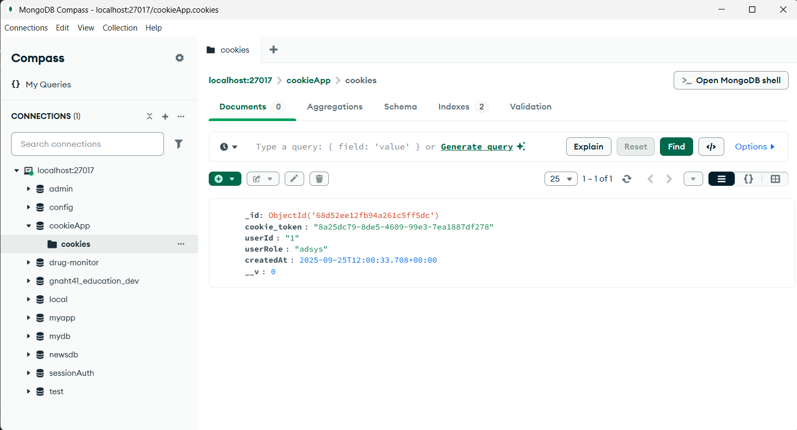
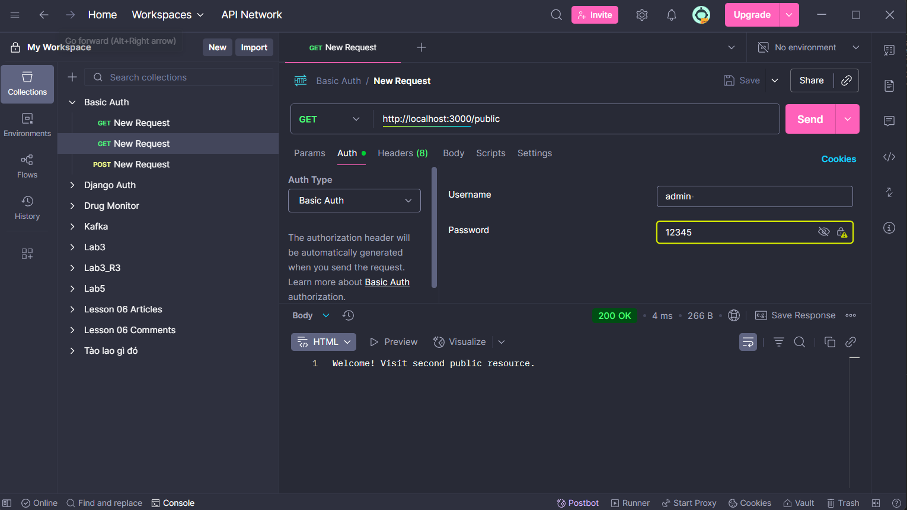
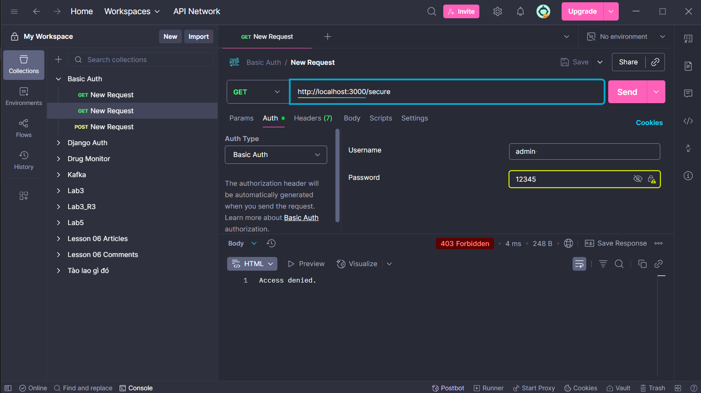
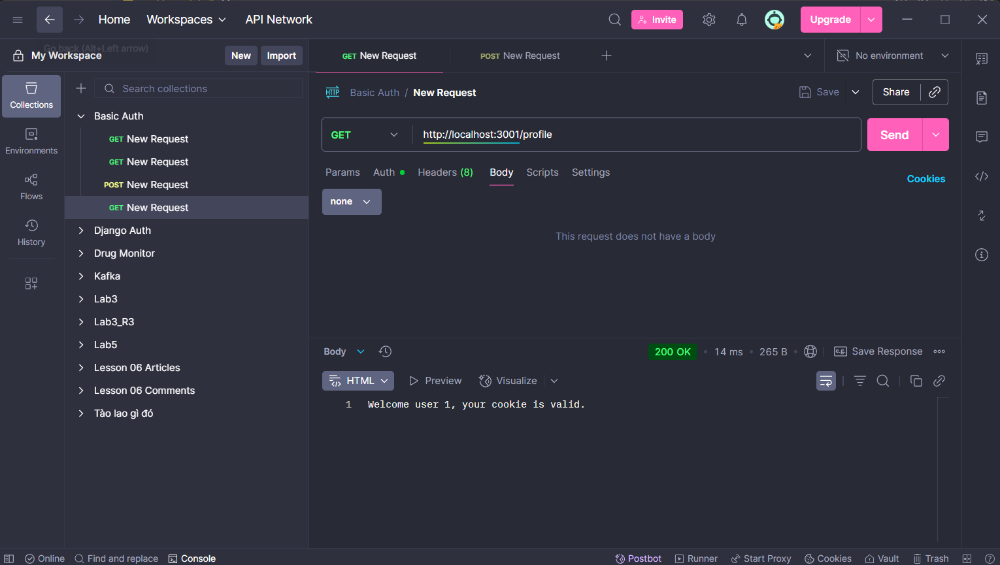
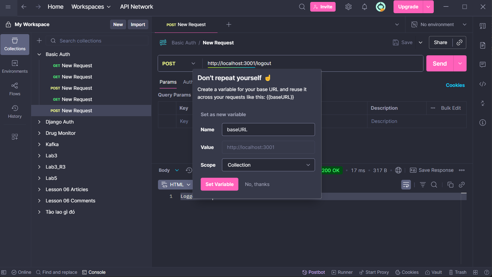

# simple_auth

Chạy các ví dụ auth đơn giản bằng Node.js + Express.

## Yêu cầu
- Node.js >= 18

## Cài đặt & Chạy

- npm i
- node basic_auth.js # ví dụ Basic Auth
- GET http://localhost:3000/
- Kết quả: 200 trả về nội dung public

# hoặc:
node cookie_auth.js # ví dụ Cookie (nếu được yêu cầu)
- POST http://localhost:3001/login
- Kết quả: 200 trả về nội dung public

