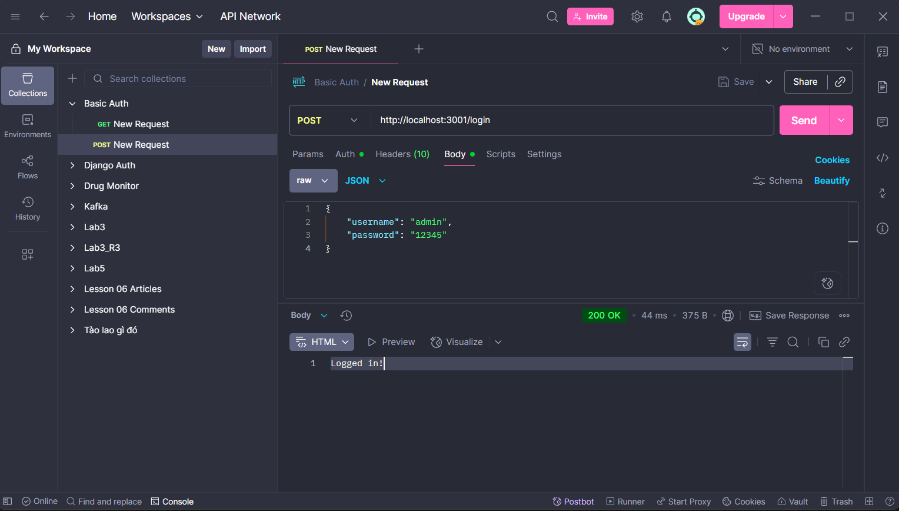

# simple_auth


Chạy các ví dụ auth đơn giản bằng Node.js + Express.


## Yêu cầu
- Node.js >= 18


## Cài đặt & Chạy
```bash
npm i
node basic_auth.js # ví dụ Basic Auth
GET http://localhost:3000/
Kết quả: 200 trả về nội dung public



# hoặc:
node cookie_auth.js # ví dụ Cookie (nếu được yêu cầu)